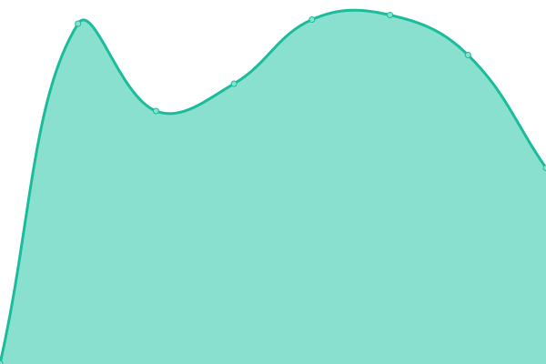

# [📈 Live Status](https://pwmonitor.github.io/monikosi): <!--live status--> **🟥 Complete outage**

This repository contains the open-source uptime monitor and status page for [pwmonitor](https://pwmonitor.github.io/monikosi), powered by [Upptime](https://github.com/upptime/upptime).

With [Upptime](https://upptime.js.org), you can get your own unlimited and free uptime monitor and status page, powered entirely by a GitHub repository. We use [Issues](https://github.com/pwmonitor/monikosi/issues) as incident reports, [Actions](https://github.com/pwmonitor/monikosi/actions) as uptime monitors, and [Pages](https://pwmonitor.github.io/monikosi) for the status page.

<!--start: status pages-->
<!-- This summary is generated by Upptime (https://github.com/upptime/upptime) -->
<!-- Do not edit this manually, your changes will be overwritten -->
<!-- prettier-ignore -->
| URL | Status | History | Response Time | Uptime |
| --- | ------ | ------- | ------------- | ------ |
|  [kosilum.com](https://www.kosilum.com) | 🟥 Down | [kosilum-com.yml](https://github.com/pwmonitor/monikosi/commits/HEAD/history/kosilum-com.yml) | 

 3025ms
     
 | 

<a href="https://pwmonitor.github.io/monikosi/history/kosilum-com">99.98%</a>
    

|  [kosilum.com-http](http://www.kosilum.com) | 🟥 Down | [kosilum-com-http.yml](https://github.com/pwmonitor/monikosi/commits/HEAD/history/kosilum-com-http.yml) | 

 1647ms
     
 | 

<a href="https://pwmonitor.github.io/monikosi/history/kosilum-com-http">99.99%</a>
    

|  [kosilight.uk](https://kosilight.uk) | 🟥 Down | [kosilight-uk.yml](https://github.com/pwmonitor/monikosi/commits/HEAD/history/kosilight-uk.yml) | 

 1635ms
     
 | 

<a href="https://pwmonitor.github.io/monikosi/history/kosilight-uk">99.99%</a>
    

|  [kosilight.uk-http](http://kosilight.uk) | 🟥 Down | [kosilight-uk-http.yml](https://github.com/pwmonitor/monikosi/commits/HEAD/history/kosilight-uk-http.yml) | 

 1212ms
     
 | 

<a href="https://pwmonitor.github.io/monikosi/history/kosilight-uk-http">100.00%</a>
    

<!--end: status pages-->

[**Visit our status website →**](https://pwmonitor.github.io/monikosi)

## 📄 License

- Powered by: [Upptime](https://github.com/upptime/upptime)
- Code: [MIT](./LICENSE) © [pwmonitor](https://pwmonitor.github.io/monikosi)
- Data in the `./history` directory: [Open Database License](https://opendatacommons.org/licenses/odbl/1-0/)
